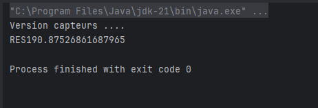
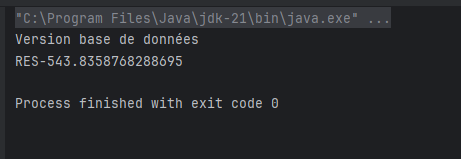

# Projet Spring - Injection de dépendances

## Description

Ce projet illustre les concepts d'injection de dépendances en Java avec Spring. Il met en œuvre plusieurs manières d'injecter des dépendances :

- **Injection par constructeur**
- **Injection par setter**
- **Injection avec Spring** (annotations et XML)

## Structure du projet

Le projet est organisé en plusieurs packages :

### `net.lamsiyeh.dao` : Accès aux données
- **IDao** : Interface d'accès aux données.
- **DaoImpl** : Implémentation accédant à une base de données.
- **DaoImpV2** : Une autre implémentation utilisant des capteurs.

### `net.lamsiyeh.metier` : Logique métier
- **IMetier** : Interface du métier.
- **IMetierImpl** : Implémentation qui utilise un IDao injecté.

### `net.lamsiyeh.pres` : Présentation (Main)
- **Pres** : Instanciation manuelle des dépendances.
- **Pres2** : Instanciation dynamique via réflexion.
- **PresSpringAnnotation** : Utilisation de Spring avec annotations.
- **PresSpringXml** : Utilisation de Spring avec configuration XML.

## 1️⃣ Configuration avec annotations

Les classes **DaoImpl**, **DaoImpV2** et **IMetierImpl** sont annotées avec `@Component`, et Spring gère l'injection automatiquement. La classe **PresSpringAnnotation.java** charge le contexte Spring.

## Configuration XML

Un fichier **config.xml** définit les beans et leurs dépendances. 

Screenshots : 

